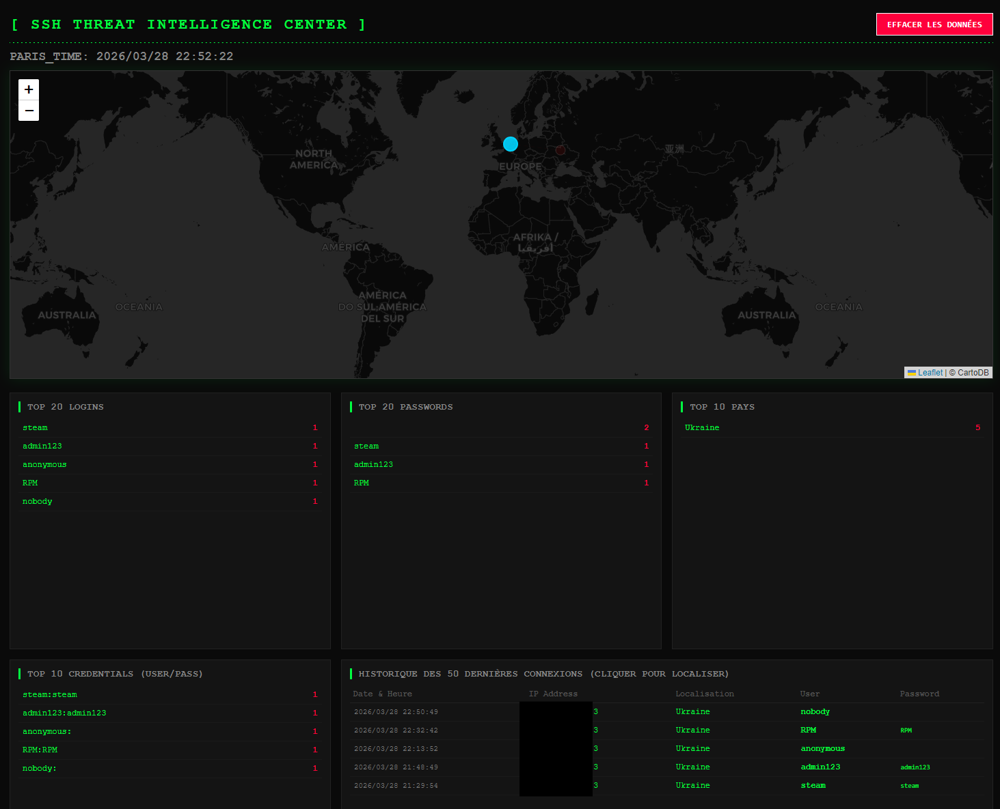

# 🛡️ SSH Honeypot SOC & Live Map


## Aperçu du dashboard

<p align="left">
  
</p>

## 🚀 Fonctionnalités

* **Capture furtive** : Simule un serveur SSH pour enregistrer les couples Utilisateur / Mot de passe.
* **Géolocalisation précise** : Utilisation de la base de données MaxMind GeoLite2 (Pays, Ville, Coordonnées).
* **Live Dashboard** :
    * **Carte Mondiale** : Visualisation des attaques avec traits de liaison vers votre serveur (point bleu).
    * **Effet Dynamique** : Les points d'attaque s'estompent et disparaissent automatiquement après 20 secondes.
    * **Top Stats** : Classement en temps réel des logins, mots de passe et pays les plus actifs.
    * **Investigation au clic** : Cliquez sur une ligne de l'historique pour zoomer sur l'attaquant avec un marqueur vert et voir les détails de l'attaque.
* **Formatage précis** : Horloge et logs synchronisés sur l'heure de Paris (YYYY/MM/DD HH:mm:ss).
* **Maintenance** : Bouton Reset intégré pour purger la base de données MySQL.

---

## 🛠️ Architecture

L'application est conteneurisée avec Docker Compose :
1. **MySQL 8.0** : Stockage des tentatives.
2. **Honeypot (Python/Paramiko)** : Intercepte les connexions et gère la géolocalisation locale.
3. **Dashboard (Flask/Leaflet.js)** : API et interface web dynamique.

---

## 📦 Installation

### 1. Pré-requis
* Docker et Docker Compose installés sur votre machine.
* Un compte (gratuit) chez MaxMind pour obtenir une licence GeoIP.

### 2. Initialisation
Clonez le dépôt et lancez le script de configuration automatique :

```bash
git clone [https://github.com/Jfou13/honeypot_soc.git](https://github.com/Jfou13/honeypot_soc.git)
cd ssh-honeypot-soc
chmod +x setup.sh
./setup.sh
```


### 3. Configuration GeoIP
Éditez le fichier GeoIP.conf à la racine et insérez vos identifiants MaxMind :

```
AccountID VOTRE_ID
LicenseKey VOTRE_CLE
EditionIDs GeoLite2-City GeoLite2-Country
```

### 4. Lancement
```bash
docker compose up -d --build
```

### 5. Téléchargement des bases de données
Lancez la mise à jour initiale des bases de localisation :
```bash
docker exec -it honeypot-ssh geoipupdate -v -d /var/lib/GeoIP
```
---

## ⚙️ Configuration (.env)

Vous pouvez modifier les variables suivantes dans le fichier .env :

* `SSH_PORT` : Port d'écoute du piège SSH (défaut: 22).
* `DASHBOARD_PORT` : Port de l'interface web (défaut: 8080).
* `SERVER_LAT` / `SERVER_LON` : Coordonnées GPS de votre serveur (point bleu sur la carte).

---

## 📊 Utilisation

* Dashboard : http://localhost:8080
* Simuler une attaque : `ssh user@localhost`
* Logs en temps réel : `docker compose logs -f honeypot-ssh`

---

## ⚠️ Avertissement de sécurité

Ce projet est destiné à des fins de recherche en cybersécurité. 
1. Si vous l'exposez sur le port 22, paramétrez un port différent pour votre accès ssh légitime.
2. L'interface web n'est pas protégée par mot de passe. Il est fortement recommandé de ne l'ouvrir qu'en local ou via un tunnel SSH/VPN.

---

## 📜 Licence
Distribué sous la licence MIT.